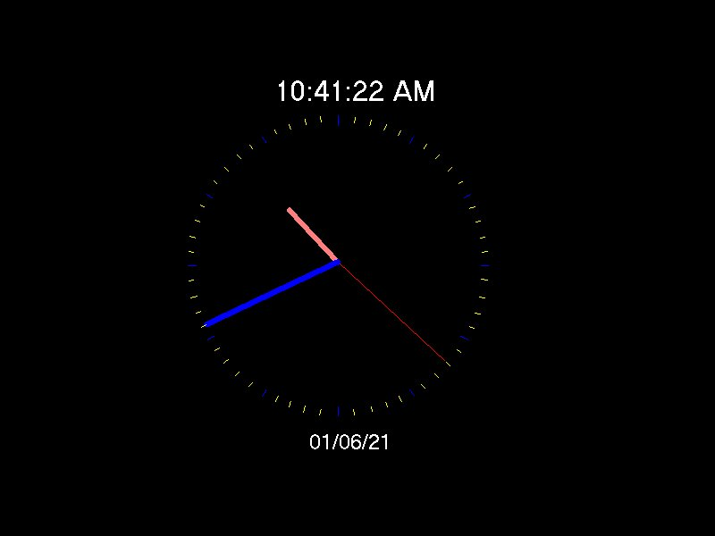



## simple clock

### Description

This is just a simple clock program.
 
### More Info
 

             |
---                |---
**Submitted On**   |2001-04-19 18:23:14
**By**             |[Dino Scarcella](https://github.com/Planet-Source-Code/PSCIndex/blob/master/ByAuthor/dino-scarcella.md)
**Level**          |Beginner
**User Rating**    |4.5 (18 globes from 4 users)
**Compatibility**  |VB 3\.0, VB 4\.0 \(16\-bit\), VB 4\.0 \(32\-bit\), VB 5\.0, VB 6\.0
**Category**       |[Miscellaneous](https://github.com/Planet-Source-Code/PSCIndex/blob/master/ByCategory/miscellaneous__1-1.md)
**World**          |[Visual Basic](https://github.com/Planet-Source-Code/PSCIndex/blob/master/ByWorld/visual-basic.md)
**Archive File**   |[simple clo185804202001\.zip](https://github.com/Planet-Source-Code/dino-scarcella-simple-clock__1-22539/archive/master.zip)

